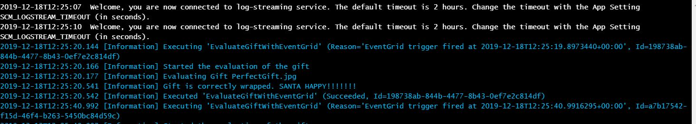
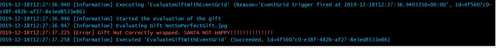
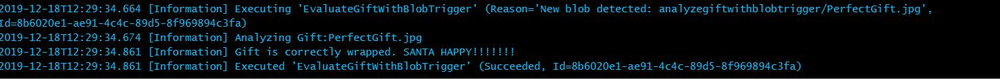
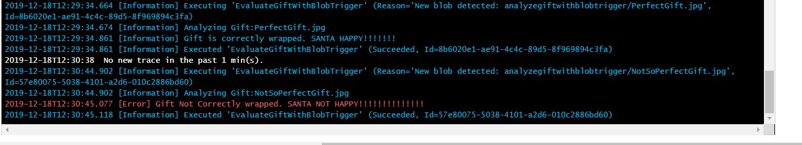

# [25 Days of Serverless](https://25daysofserverless.com)
[CHALLENGE 18: WRAPPING THE PERFECT GIFT](https://25daysofserverless.com/calendar/18)

The solution to the problem is implemented in two ways.
1) One Azure Function uses Blob Trigger to trigger when a blob gets created in a container defined in the function.
2) Other Azure Function uses Event Grid Trigger and subscribes to the "Blob Created Event" raised by the creation of a blob in the container.

The language used to write azure functions is C# and it uses the priciple of Dependency Injection to work with the ComputerVision Client.

## Test Data 
### [Perfectely Wrapped Gift]
#### File Name : PerfectGift
 

### [Not So Perfect Gift]
#### File Name : NotSoPerfectGift
 

## Test Results

### Azure Function With Event Grid Trigger

#### Perfectly Wrapped Gift
 

#### Not So Perfectly Wrapped Gift
 

### Azure Function With Blob Trigger

#### Perfectly Wrapped Gift
 

#### Not So Perfectly Wrapped Gift
 

